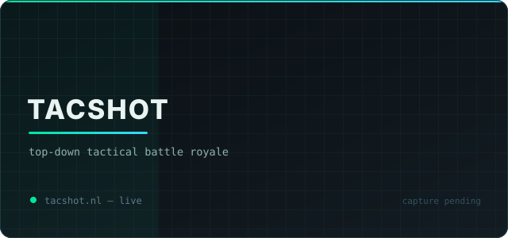
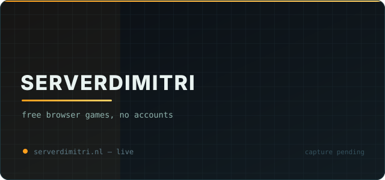
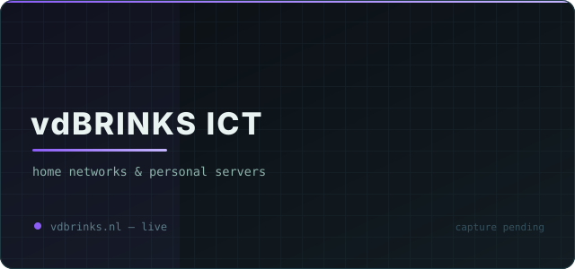
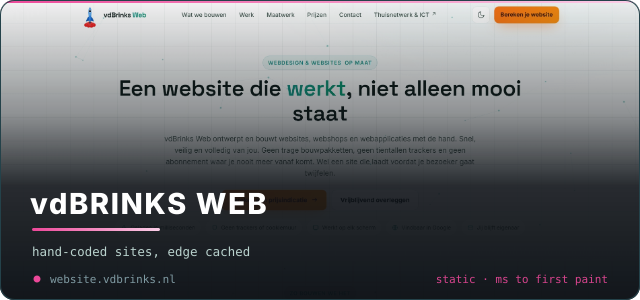
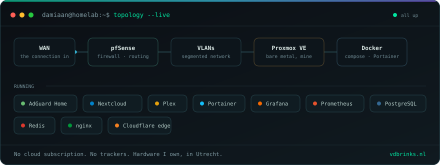
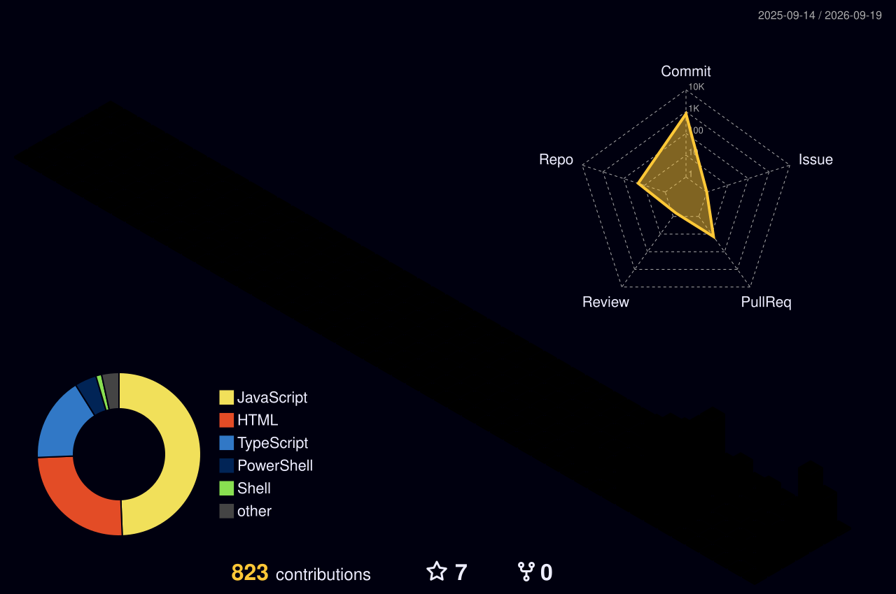

<!-- ────────────────────────────────────────────────────────────────
     damiaan111/damiaan111 — GitHub profile README
     Every section is documented in the private repo: profile-lab
     docs/02-readme-anatomy.md explains each block, URL and parameter.
     ──────────────────────────────────────────────────────────────── -->

<!-- ══════════════ 1. HERO ══════════════ -->

<picture>
  <source media="(prefers-color-scheme: dark)"  srcset="./assets/hero-dark.svg">
  <source media="(prefers-color-scheme: light)" srcset="./assets/hero-light.svg">
  
</picture>

<!-- ══════════════ 2. TYPING LINE ══════════════ -->

 

<!-- ══════════════ 3. QUICK LAUNCH BUTTONS ══════════════ -->

 

<!-- Contact address. This is a PERSONAL profile: no employer address, no
     employer domain, nowhere on this page. Do not "helpfully" swap this
     for a work mailbox. -->

  

<!-- ══════════════ 4. LIVE STATUS STRIP ══════════════
     These read a small JSON file you serve yourself.
     See docs/05-live-badges.md — until those endpoints exist,
     comment this block out rather than shipping broken images. -->
<!--

-->

---

<!-- ══════════════ 5. PROJECT SHOWCASE ══════════════ -->
<h2 align="center">⚡ What I ship</h2>

<table align="center">
<tr>
<td width="50%" valign="top">

### 🎯 TacShot

Top-down tactical battle royale in the browser. 20 combatants, a
closing storm, one life. Cone-of-vision rendering — you only see
what you face. Killcams, spectating, daily missions, prestige ranks,
controller support, 60 FPS on a canvas.

**Vanilla JS · HTML5 Canvas · no engine · no accounts**

</td>
<td width="50%" valign="top">

### 🕹 ServerDimitri

My browser-games platform. Four titles, sorted honestly into
**main project**, **side projects** and **abandoned** — because
pretending everything is maintained is worse than admitting it isn't.
No downloads, no accounts, no ads, no tracking. Progress lives in
your own browser.

**Cloudflare edge · static · zero telemetry**

</td>
</tr>
<tr>
<td width="50%" valign="top">

### 🛠 vdBrinks ICT

Home networks and personal servers, from Utrecht. Wi-Fi and mesh
that actually covers the house, VLANs and firewalling, AdGuard DNS
filtering, Nextcloud and Plex on hardware you own, Docker and
Portainer with monitoring that tells you before the user does.

**Nextcloud · Plex · Docker · Portainer · AdGuard Home**

</td>
<td width="50%" valign="top">

### 🌐 vdBrinks Web

Websites, webshops and web apps written by hand. No page builder,
no plugin stack, no database waiting to be exploited — static, edge
cached, milliseconds to first paint. The client owns the code and
the domain when it ships.

**Static · edge-cached · hand-written HTML/CSS/JS**

</td>
</tr>
</table>

---

<!-- ══════════════ 6. THE HOMELAB ══════════════
     Hand-written SVG, in this repo. It depends on no service at all, which
     after ADR-018 is the point.

     It exists because the profile has an honest gap: the infrastructure work
     is the largest part of what he does and none of it is a public repo, so
     without this the page argues "two repositories" (docs/07-decisions.md,
     ADR-009).

     DO NOT EDIT assets/homelab.svg BY HAND. It is generated:

         python scripts/build-homelab.py

     The service list and the chain live at the top of that script. It
     measures every label, wraps the rows and grows the canvas to fit, which
     the hand-placed first version did not - two labels overflowed their boxes
     immediately. It validates its own XML before writing.

     Contents are Damiaan's actual stack as of 2026-09-15. If something
     changes, edit the data in the script and re-run it. -->
<h2 align="center">🏠 The homelab</h2>

  

---

<!-- ══════════════ 7. METRICS — TERMINAL ══════════════
     Generated by .github/workflows/metrics.yml (lowlighter/metrics).
     Committed as a file, so it never depends on a third-party service
     being up when someone loads this page. -->
<h2 align="center">🖥 ssh damiaan@github</h2>

  

---

<!-- ══════════════ 8. METRICS — ISOMETRIC + LANGUAGES ══════════════ -->
<table align="center"><tr>
<td width="50%"></td>
<td width="50%"></td>
</tr></table>

---

<!-- ══════════════ 9. GITHUB STATS ROW ══════════════
     The left panel is generated by metrics.yml and COMMITTED into this repo,
     like every other panel here. The right cell is the one live card on this
     page that still comes from a third party.

     What was here before: github-readme-stats.vercel.app (stats + top-langs)
     and, in its own section further down, github-profile-trophy.vercel.app.
     All three broke at once, and not because of a bad parameter — the public
     deployments returned 503 DEPLOYMENT_PAUSED and 402 "Payment required".
     They run on somebody else's free Vercel account, so the profile was one
     billing decision away from three broken images. It found that decision.
     See docs/07-decisions.md ADR-018.

     Top-langs is simply gone: metrics.languages.svg in section 8 already
     shows that, in more detail and from a token that can see private repos.

     TWO plugins were tried for the right-hand cell and both painted
     "Unexpected error" into the SVG on a GREEN job - achievements (queries
     Projects (classic), which GitHub has sunset) and activity (unguarded
     payload.commits.filter). The streak card holds the cell instead, because
     it works. The long note in metrics.yml has the detail.

     Half-width cells, because every metrics panel is natively 480px wide —
     across the full page width it would be an upscale (ADR-014). At 50% of
     the table each cell lands near that native width. -->

<table align="center"><tr>
<td width="50%" valign="top"></td>
<td width="50%" valign="top">

<!-- streak-stats.demolab.com is a different deployment under a different
     account, and it returns 200. width="100%" because its native 495px
     overflows a half-width cell; inside this cell that is a slight
     downscale, not an upscale. -->

</td>
</tr></table>

---

<!-- ══════════════ 10. SNAKE ══════════════
     Generated by .github/workflows/snake.yml into the `output` branch. -->

<picture>
  <source media="(prefers-color-scheme: dark)"  srcset="https://raw.githubusercontent.com/damiaan111/damiaan111/output/snake-dark.svg">
  <source media="(prefers-color-scheme: light)" srcset="https://raw.githubusercontent.com/damiaan111/damiaan111/output/snake.svg">
  
</picture>

---

<!-- ══════════════ 11. 3D CONTRIBUTION CALENDAR ══════════════
     Generated by .github/workflows/3d-contrib.yml -->

  

---

<!-- ══════════════ 12. THE STACK ══════════════ -->
<h2 align="center">🧰 The stack I actually use</h2>

**Games — engineless, on purpose**

**Web — hand-written, edge-cached**

**Infrastructure — self-hosted, mine**

<!-- skillicons has no icons for these; simple-icons (via shields) does.
     These must match the homelab panel directly above - this row says "mine",
     so it lists what actually runs on his Proxmox host, not what he deploys
     for clients. Nextcloud was here until 2026-09-15 and was wrong: that is a
     vdBrinks ICT service (see the project card), not something in his own lab.
     He runs Immich for photos. Regenerate the panel and update this row
     together, or they drift apart again. -->

**Client IT — tenants, endpoints, automation**

---

<!-- ══════════════ 13. FOOTER ══════════════ -->

### Nobody visits GitHub profiles. You did. Go play something.

  

